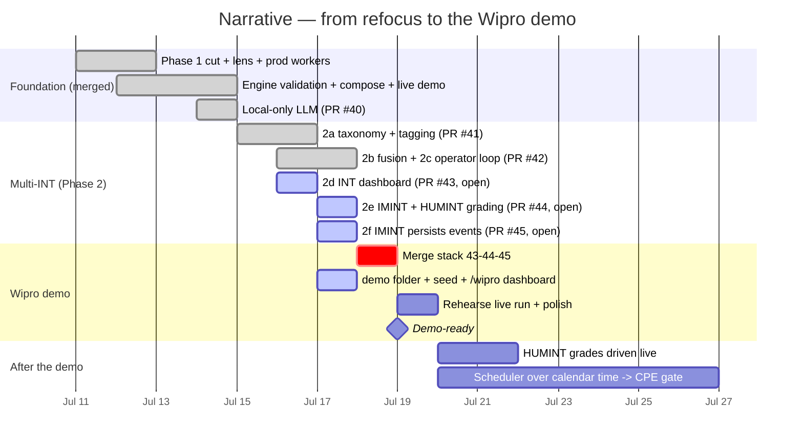

# Narrative — where we are, and the road to the Wipro demo

## Status at a glance (2026-07-17)

| Milestone | State |
|---|---|
| Phase 1 cut + refocus (personalized consequence chain) | ✅ merged (Jul 11–12) |
| Engine validation, ollama-in-compose, one-command live demo | ✅ merged (Jul 12–14) |
| LLM local-only — Anthropic removed, $0 doctrine | ✅ merged PR #40 (Jul 14) |
| Phase 2a — INT-discipline taxonomy + deterministic tagging | ✅ merged PR #41 (Jul 15–16) |
| Phase 2b+2c — cross-discipline fusion + agentic operator loop | ✅ merged PR #42 (Jul 17, main `8e8520c`) |
| Phase 2d — INT Fusion dashboard `/int` + discipline lens | 🟡 **PR #43 open** (green, mergeable) |
| Phase 2e — IMINT interpretation + HUMINT NATO-Admiralty grading | 🟡 **PR #44 open** (green, stacked on #43) |
| Phase 2f — IMINT persists real events + 3 live vision fixes | 🟡 **PR #45 open** (green, stacked on #44) |
| **Wipro demo — customer-centric dashboard `/wipro` + this folder** | 🔨 this branch (`demo/wipro`, stacked on #45) |

**Blocking step: merge the stack in order #43 → #44 → #45** (merge commits, not squash —
they are stacked). Known gotcha: a stale `GITHUB_TOKEN` env var shadows the keyring login
and makes `gh pr merge` fail 401 — `unset GITHUB_TOKEN` first.

## Timeline

## What "finished" means for the demo

1. Stack #43→#44→#45 merged, `demo/wipro` rebased onto main and merged.
2. `docker compose up` + `seed_scenario.py` + login → `/wipro` renders all seven panels
   from live endpoints; fusion strip shows the Gulf cluster fusing CYBINT+HUMINT+FININT.
3. Ask-the-Analyst answers live on the local model ($0, unlimited — the quota contrast).
4. Rehearse once end-to-end before the meeting (cold llava/llama calls take minutes on CPU;
   warm the models first — `OLLAMA_KEEP_ALIVE=30m` is already set in compose).
